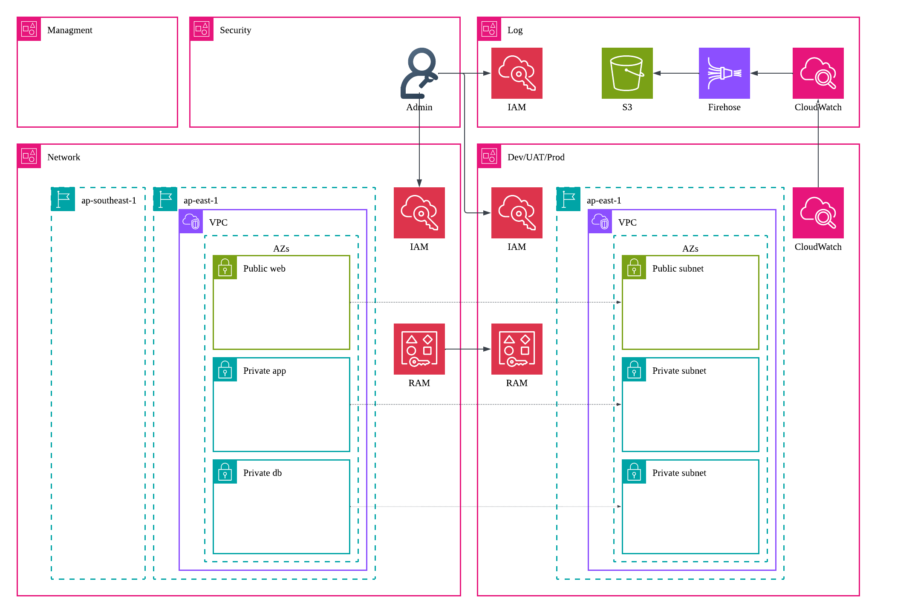
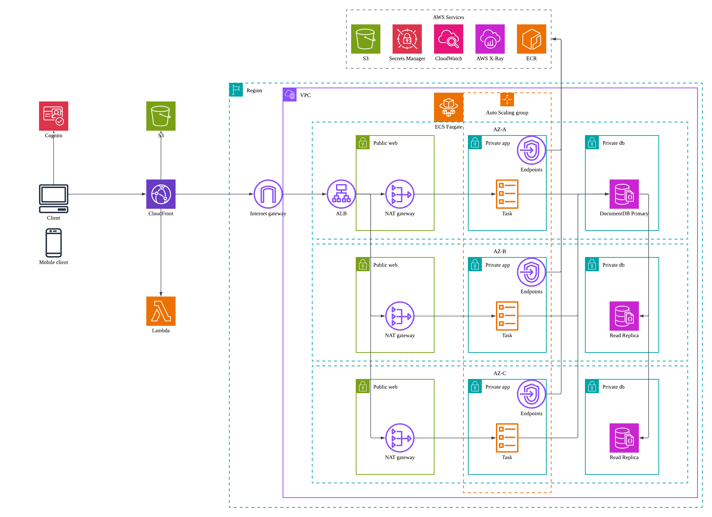
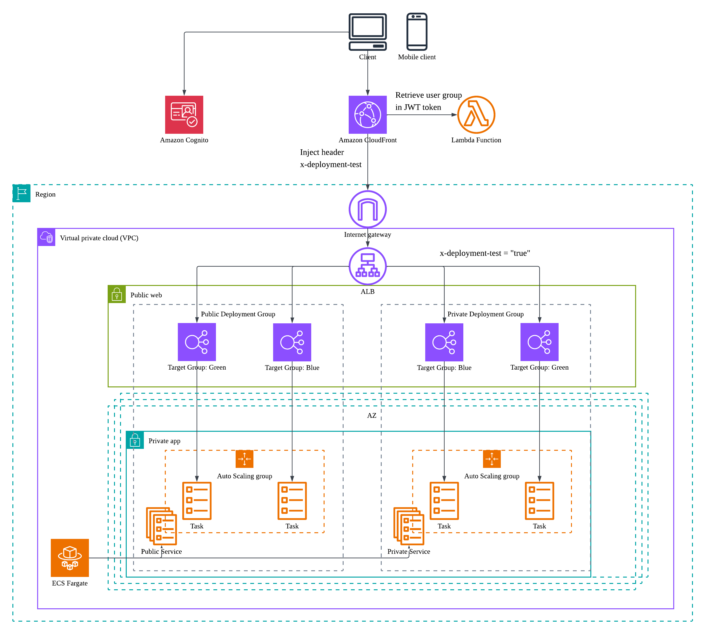

# Production-grade Highly Available Cloud Platform

A production-grade, highly available cloud platform engineered from scratch. This repository features a containerized Spring Boot microservice deployed on AWS ECS Fargate and Terraform modules for provisioning Dev/UAT/Prod environments across Hong Kong (`ap-east-1`) and Singapore (`ap-southeast-1`) regions.

## 🔗 Project Links
* **Live Demo Site:** [workoutplanner.fit](https://www.workoutplanner.fit/)
* **API Specifications:** [OpenAPI Documentation](https://arthastsang.github.io/WorkoutPlanner/)

## 🏗️ System Architecture
Click on each section below to expand the architectural blueprints and implementation details for this platform.

🏢 1. Organization Architecture (Multi-Account Topology)

  

* **Scope**: Visualizes the organizational structure and account segregation.
* **Key Components**: AWS Organizations, cross-account IAM roles creation and VPC resource sharing via RAM.

💻 2. Application Architecture (Microservices & Edge Security)

  

* **Scope**: Details the ingress traffic flow, edge-secured token validation, and microservice runtime.
* **Key Components**: AWS Cognito, CloudFront, Lambda@Edge JWT validation, Application Load Balancers, ECS Fargate, and DocumentDB cluster.

🚀 3. Deployment Architecture (CI/CD)

  

* **Scope**: Illustrates how to support a public-pilot environment fully capable of blue-green deployment.
* **Key Components**: Application Load Balancers, target groups, and CodeDeploy blue/green pipelines.

## 📖 Engineering Strategy & System Design
For a deep dive into the implementation details and alignment with the **AWS Well-Architected Framework**, read the comprehensive **[System Design Document](docs/System-design.docx)**.

## 📁 Repository Directory Structure
| Directory | Layer | Description | Tech Stack |
| :--- | :--- | :--- | :--- |
| `frontend` | Presentation | Single Page Application (SPA) | React.js |
| `workout` | Application | Containerized microservices & deployment pipelines | Spring Boot, AWS CodeDeploy |
| `terraform-security` | Security | Base IAM roles, policies and permission boundaries | Terraform, AWS IAM |
| `terraform-network` | Core Infrastructure | VPC layout, security groups, Interface Endpoints, and RAM | Terraform, AWS VPC, RAM |
| `terraform-platform` | Shared Services | Edge routing, auth, compute clusters, and database clusters | Terraform, AWS Cognito, CloudFront, ALB, ECS, DocumentDB |
| `docs` | Documentation | Architectural diagrams and OpenAPI specs | Lucidchart, OpenAPI |

## 🛠️ Infrastructure Deployment Sequence
Deploy the Terraform modules in the following strict chronological order:
1. `terraform-security` (Establishes cross-account roles and permission boundaries)
2. `terraform-network` (Provisions isolated VPCs and transit routing)
3. `terraform-platform` (Launches core compute clusters, databases, and CDN)
4. `workout` (Builds, registers, and deploys application containers)